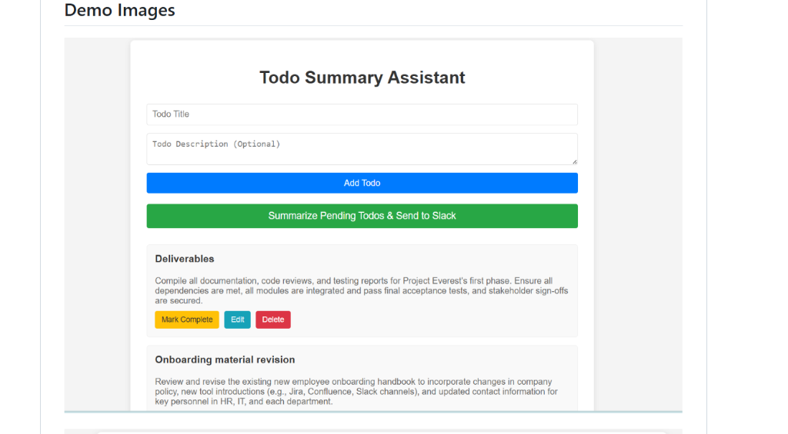
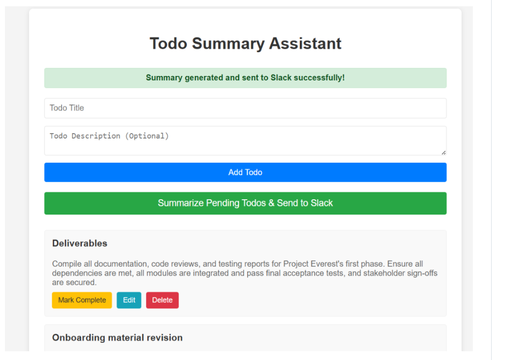
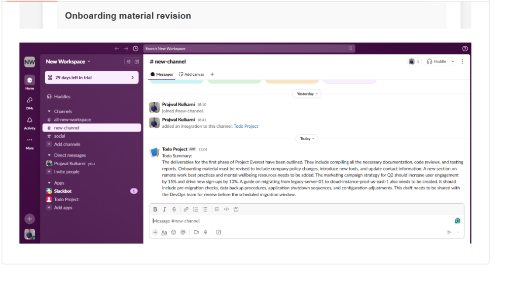

# Todo Summary Assistant - Production DevOps Delivery Pipeline

A full-stack application to manage personal to-do items, summarize pending tasks using the Cohere LLM, and send summaries to Slack, enhanced with a production-ready **DevOps Delivery Pipeline**, multi-stage containerization, AWS cloud infrastructure (EC2 + RDS), CI/CD automation, and Prometheus/Grafana observability.

---

## 📸 Application Demo & Walkthrough

Below is the step-by-step demonstration of the **Todo Summary Assistant** in action:

### 1. Web Application Interface & Todo Management
Users can create, view, edit, and complete tasks. Clicking **"Summarize Pending Todos & Send to Slack"** triggers the backend integration.



### 2. Summary Generation & Instant Alert
The backend uses Cohere LLM to process all pending to-dos and returns a success confirmation banner to the frontend UI:



### 3. Automated Slack Notification Delivery
The AI-generated executive summary is automatically posted to the configured Slack workspace channel (`#new-channel`) via Incoming Webhooks:



---

## 1. DevOps Enablement Modifications

To transform the base application into a cloud-native, containerized production release without altering core business logic, the following DevOps enablements were made:

1. **Prometheus Observability Enablement**:
   - Added `spring-boot-starter-actuator` and `micrometer-registry-prometheus` dependencies to `Backend/todo-summary-assistant/pom.xml`.
   - Configured `application.properties` to expose `/actuator/prometheus` and `/actuator/health` endpoints.
2. **Configuration Externalization**:
   - Replaced hardcoded database parameters, Cohere API key, Slack webhook URL, and CORS allowed origins in `application.properties` with environment variables fallback syntax (`${VARIABLE_NAME:default}`).
   - Updated `Frontend/todo/src/services/todoService.js` to dynamically read `process.env.REACT_APP_API_BASE_URL`.
3. **Multi-Stage Non-Root Dockerization**:
   - Created multi-stage `Dockerfile` for backend using `eclipse-temurin:17-jre-alpine` and runtime user `appuser` (non-root).
   - Created multi-stage `Dockerfile` for frontend using `nginxinc/nginx-unprivileged:alpine` listening on port `8080` (non-root).
4. **Nginx SPA Routing Proxy**:
   - Added custom `nginx.conf` to handle client-side React routes and reverse proxy API calls.

### Docker Architecture & Design Choices
- **Multi-Stage Build Size Optimization**: 
  - **Backend**: Stage 1 (`maven:3.9.9-alpine`) leverages layer caching for dependencies via `mvn dependency:go-offline` and packages the application. Stage 2 (`eclipse-temurin:17-jre-alpine`) copies only the compiled `.jar`, reducing final image size from ~650MB down to ~160MB.
  - **Frontend**: Stage 1 (`node:20-alpine`) builds production static assets via `npm run build`. Stage 2 (`nginxinc/nginx-unprivileged:alpine`) serves static assets via Nginx without Node.js runtime, reducing final image size down to ~25MB.
- **Non-Root Security Hardening**:
  - **Backend**: Executes under dedicated unprivileged user `appuser` (UID/GID 10001) instead of root.
  - **Frontend**: Runs using `nginxinc/nginx-unprivileged:alpine` on non-privileged port `8080` to enforce strict non-root compliance.
- **Build Layer Caching & `.dockerignore`**:
  - Dependency manifests (`pom.xml`, `package.json`) are copied before application source code to optimize build caching. `.dockerignore` excludes `node_modules/`, `target/`, `.git/`, and temporary build artifacts.
- **Container Health & Lifecycle**:
  - Embedded `HEALTHCHECK` instructions poll `/actuator/health` (Backend) and `/health` (Frontend) every 30 seconds to support auto-healing and zero-downtime rolling deployments.

---

## 2. Project Architecture & Infrastructure Layout

```
                  +----------------------------------------------+
                  |           GitHub Actions CI/CD               |
                  +----------------------+-----------------------+
                                         |
                       Push Image &      | SSH Automated
                       Build Container   | Deployment
                                         v
+-----------------------------------------------------------------------------------+
| AWS VPC (10.0.0.0/16)                                                             |
|                                                                                   |
|  +-----------------------------------------------------------------------------+  |
|  | Public Subnet (10.0.1.0/24) - Amazon EC2 Instance                            |  |
|  |                                                                             |  |
|  |  [ React Frontend ] ----> [ Spring Boot Backend ] ----> [ Prometheus ]      |  |
|  |  (Nginx / Port 3000)      (Port 8080 / Actuator)       (Port 9090)          |  |
|  |                                    |                        |               |  |
|  |                                    v                        v               |  |
|  |                             [ AWS RDS MySQL ]         [ Grafana ]           |  |
|  |                             (Private Subnet / 3306)   (Port 3001)           |  |
|  +-----------------------------------------------------------------------------+  |
+-----------------------------------------------------------------------------------+
```

---

## 3. Local Execution & Quickstart Guide

### Method 1: Containerized Local Stack via Docker Compose (Recommended)

Run the full stack (MySQL DB, Spring Boot Backend, React Frontend, Prometheus, Node Exporter, Grafana) with a single command:

1. **Clone the Repository**:
   ```bash
   git clone https://github.com/Praj122/TodoSummaryAssistant.git
   cd TodoSummaryAssistant
   ```

2. **Configure Environment Variables**:
   ```bash
   cp .env.example .env
   # Edit .env to supply COHERE_API_KEY and SLACK_WEBHOOK_URL if desired
   ```

3. **Launch the Container Stack**:
   ```bash
   docker compose up -d --build
   ```

4. **Access Applications & Dashboards**:
   - **React Frontend**: [http://localhost:3000](http://localhost:3000)
   - **Spring Boot API**: [http://localhost:8080/api/todos](http://localhost:8080/api/todos)
   - **Actuator Health**: [http://localhost:8080/actuator/health](http://localhost:8080/actuator/health)
   - **Prometheus Metrics**: [http://localhost:8080/actuator/prometheus](http://localhost:8080/actuator/prometheus)
   - **Prometheus Dashboard**: [http://localhost:9090](http://localhost:9090)
   - **Grafana Dashboard**: [http://localhost:3001](http://localhost:3001) (User/Pass: `admin`/`admin`)

---

### Method 2: Manual Local Build & Development

#### Prerequisites
- Java JDK 17+
- Maven 3.9+
- Node.js 20+ & npm
- MySQL Server 8.0+

#### 1. Database Setup
Start local MySQL server and execute:
```sql
CREATE DATABASE todo_db;
```

#### 2. Backend Setup
```bash
cd Backend/todo-summary-assistant
export SPRING_DATASOURCE_URL="jdbc:mysql://localhost:3306/todo_db?createDatabaseIfNotExist=true"
export SPRING_DATASOURCE_USERNAME="root"
export SPRING_DATASOURCE_PASSWORD="your_password"
mvn clean install
mvn spring-boot:run
```

#### 3. Frontend Setup
```bash
cd Frontend/todo
export REACT_APP_API_BASE_URL="http://localhost:8080/api/todos"
npm install
npm start
```

---

## 4. Environment Variables Reference

| Variable Name | Description | Default Value | Required in Production |
| :--- | :--- | :--- | :--- |
| `SPRING_DATASOURCE_URL` | JDBC Connection URL to MySQL / RDS | `jdbc:mysql://db:3306/todo_db` | Yes |
| `SPRING_DATASOURCE_USERNAME` | Master DB username | `todouser` | Yes |
| `SPRING_DATASOURCE_PASSWORD` | Master DB password | `todopassword` | Yes |
| `COHERE_API_KEY` | API Key for Cohere Text Summarization | `YOUR_COHERE_API_KEY` | Yes (for AI features) |
| `SLACK_WEBHOOK_URL` | Incoming Webhook URL for Slack | `YOUR_WEBHOOK_URL` | Yes (for Slack features) |
| `REACT_APP_API_BASE_URL` | Frontend endpoint URL for backend API | `http://localhost:8080/api/todos` | Yes |
| `CORS_ALLOWED_ORIGINS` | Permitted origins for Spring Boot CORS | `http://localhost:3000` | Yes |

---

## 5. Repository & Submission Layout

```
TodoSummaryAssistant/
│
├── Backend/
│   └── todo-summary-assistant/
│       ├── src/, pom.xml
│       ├── Dockerfile                 # Multi-stage non-root container build
│       └── .dockerignore
│
├── Frontend/
│   └── todo/
│       ├── src/, package.json
│       ├── nginx.conf                 # Nginx proxy & SPA router
│       ├── Dockerfile                 # Multi-stage non-root container build
│       └── .dockerignore
│
├── docs/
│   └── images/                        # Application demo UI & Slack notification screenshots
│       ├── demo_todo_ui.png
│       ├── demo_summary_success.png
│       └── demo_slack_notification.png
│
├── .github/workflows/
│   └── ci-cd.yml                      # Full automated CI/CD pipeline definition
│
├── aws/
│   ├── architecture-diagram.png       # Complete visual AWS deployment architecture
│   ├── aws-setup.md                   # Networking, Security Groups, IAM & Secrets guide
│   └── iac/                           # Terraform IaC automation code
│       ├── main.tf
│       ├── variables.tf
│       ├── outputs.tf
│       ├── providers.tf
│       └── terraform.tfvars.example
│
├── monitoring/
│   ├── prometheus.yml                 # Prometheus scrape configuration
│   ├── alert-rules.yml                # Production alerting rules
│   └── grafana-dashboard.json         # Importable Grafana dashboard JSON
│
├── docker-compose.yml                 # Full stack local orchestration file
├── .env.example                       # Complete environment variable template
├── README.md                          # Main project & setup guide
├── FAILURE_AND_ROLLBACK.md            # Incident response & 6 failure scenarios writeup
└── MONITORING_AND_OPERATIONS.md       # Operational design & observability strategy
```

---

## 6. Assumptions Made

1. **AWS Infrastructure Footprint**: Single EC2 `t3.micro` instance in Public Subnet and AWS RDS MySQL `db.t3.micro` instance in Private Subnet to remain within AWS Free Tier limits.
2. **Security**: Production deployments utilize AWS Systems Manager Parameter Store or Secrets Manager for DB credentials instead of raw environment files in source control.
3. **Containers**: Nginx runs on unprivileged port 8080 in container runtime to ensure strict compliance with non-root security standards.
